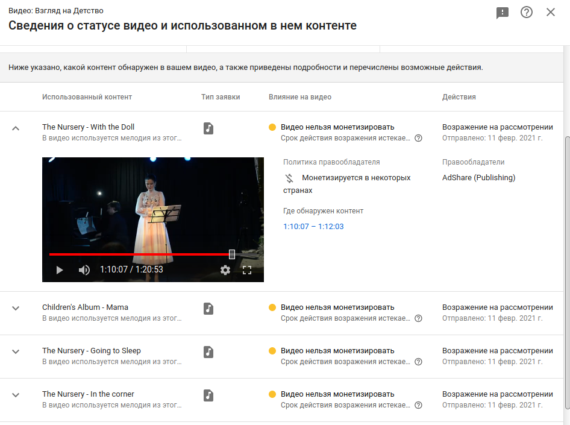

# Искра вдохновения на большую междисциплинарную работу It-шников и музыкантов

Как я и написал в теме своего доклада, я буду считать своё выступление успешным, если в процессе хотя бы у кого-нибудь из присутствующих вдруг загорятся глаза и возникнет желание написать своему знакомому IT-шнику: «друг, нужна твоя помощь, мне надо обработать данные!», или «дорогие студенты НГУ, никто не хочет свою курсовую посвятить автоматизации моей очень важной и нудной задачи?», или «Дорогой декан имярек имярекович, нет ли у вас в программе проектной работы? Нам бы приложение для того, чтобы волонтёры размечали в нём все редакции сонат Бетховена».

И у меня к вам большая просьба: если у вас такое желание возникнет — не откладывайте, пожалуйста это дело на завтра, на следующую неделю, даже на вечер: будет пересменка перед музыкальной частью, или можно параллельно с моим выступлением подумать, какие специалисты вам нужны для проекта — и писать им, заражать своей идеей. Именно так и делаются большие и успешные проекты: сразу и на энтузиазме, пока никто не успел испугаться и отказаться. Вообще, буквально пару недель назад меня точно также разбудила Надя Скворцова, которая в москве ведёт музыкальную терапию — «Друг, надо приложение, чтобы на электронном пианине ноту нажимаешь — а эта нота показывалась на весь экран ноутбука, к которому эта пианина подключена. И чтобы ничего кроме.». Вот так вот спросонья я подписался на то, чтобы написать приложуху, сейчас все концерты и доклады пройдут — и напишу))

Итак, что же это за «большая междисциплинарная работа»? У любого музыканта, который занимается научной деятельностью или просто копается в какой-то области так или иначе уже есть несколько тем, которые он хочет и собирается разрабатывать: кому-то интересны текстологические поиски, кто-то ищет опорные точки для интерпретации произведения, над которым работает: это всё давным-давно известно. Однако, чем бы мы не занимались, периодически у нас возникают трансцендентные вопросы, такие, о которых страшно и задумываться. Непонятно с какой стороны формулировать к ним задачи, а если они и формулируются, то глядя на объём работ — мы понимаем, что на это не хватит и жизни.

Допустим:

Вот — что это такое? Нет, конечно, можно, как мы привыкли, сказать: «да, случается, Моцарт тоже так умел», и закрыть на этом вопрос. Но всё-таки, можем ли мы спросить себя: «что это»? Это гены? Это система? Это среда? Музыка для беременных? Что это? У меня дочка неплохо играет на фортепиано, неплохо поёт, а на скрипке идёт с трудом. Можно было бы сказать, что это оттого, что она не рождена скрипачкой, но очевиднее — что просто я не умею играть на скрипке, и по этому плохо с ней занимаюсь, а на фортепиано занимаюсь неплохо :)

И, таким образом предположив принципиальную возможность того, что феномен этой корейской девочки объясним системой обучения, мы можем хотя бы гипотетически задизайнить исследование, можем? Люди, которые хоть что-то пытались делать в педагогике скажут, что мы его никогда не задизайним: потому что у нас не хватит детей и жизни одного человека, чтобы проверить сколько бы то ни было статистически достоверно хотя бы сотни гипотез об успешном формировании музыканта. Даже если себе поставить целью брать двухлеток и доводить до шести. Тут есть ряд этических вопросов: вроде «вы собираетесь детей использовать как лабораторных крыс?» — но, знаете, часто в наших муз школах ребят учат по педагогическим представлениям царя гороха, так что если найдутся энтузиасты, согласные начать хотя бы с условного дедушки Петрушина — детям в целом будет только польза.

Однако, новейшая история исследований уже знает несколько примеров НАСТОЛЬКО масштабных коопераций, когда на одну задачу были потрачены в эквиваленте несколько человеческих жизней: группа русских астрономов-любителей, например, недавно [организовала](https://habr.com/ru/post/175827/) поиск посадочного модуля аппарата Марс-3, и множество волонтёров буквально перекопали внушительную часть Марса, нашли аппарат. Или, в рамках проекта [«Galaxy Zoo»](http://zoo1.galaxyzoo.org/) тысячи людей промаркировали более 2 000 000 галактик.

То есть, в принципе, цель — найти оптимальный способ раннего развития музыканта исполнителя вдруг перестаёт быть софистикой и волей случая, а может быть совершенно реально задизайнено в большой социальный проект, в котором могли бы поучаствовать тысячи учителей России и Мира, сделать огромный рывок в музыкальной педагогике! Честно, эта идея выглядит так вкусно, что я бы за неё схватился прямо сейчас, но я уже облюбовал в этом саду свой кустик, который и собираюсь окучивать ближайшие пару десятков лет.

Вообще рассказ об исследовательских и более прикладных проектах, которые стали возможны благодаря выросшей за последние 20 лет IT инфраструктуре — это рассказ об инструментах. Знаете, у нас в консерватории на третьем, кажется, курсе, был предмет «основы современной нотации» Для него был небольшой такой учебник (кстати, уже достаточно старый), в котором не содержалось почти ничего кроме обыкновенного перечисления способов записи музыкального текста или произведений. Кстати, часть примеров из этого сборника вы сможете услышать завтра на концерте фестиваля в лофт-парке Подземка. Когда я всё это читал — передо мной открывались целые невиданные музыкальные миры. В одном месте сразу пробуждалось шило, зудящее и требующее немедленного творческого акта. И я очень рекомендую освободить себе вечер-два и просто ознакомиться со списком инструментов, которые сейчас используются в других областях научного знания. Первым делом можно сходить на портал [люди науки](https://citizen-science.ru/) — это как раз портал о волонтёрских исследованиях, и там можно почитать и попросить помощи с организацией армии, которая будет заниматься вашей проблемой.

Кроме того, когда мы говорим про передовые возможности IT — мы говорим о BigData или больших данных. Нередко под BigData подразумевают нейронные сети, однако я лично избегаю нейросетей по двум причинам:
- **сложно и дорого**: что-то действительно интересное натренировать могут себе позволить только большие институты, яндекс, гугл, ещё пара компаний. [ссылка](https://www.technologyreview.com/2020/11/12/1011944/artificial-intelligence-replication-crisis-science-big-tech-google-deepmind-facebook-openai/) \([перевод](https://habr.com/ru/post/530994/)\)
- **ненадёжно**: в принципе, во многих областях науки сейчас говорят о кризисе воспроизводимости результатов, однако с нейросетями всё совсем грустно — есть [исследование](http://repeatability.cs.arizona.edu/) \([разбор на русском](https://habr.com/ru/post/480348/)\) аризонского университета, в котором исследователям удалось просто запустить только треть кодовой базы их статей. Это ещё не вдаваясь в подробности того — точно ли код делает то, что заявлено в статье.

Сам я не так давно хотел использовать достаточно разрекламированную библиотеку для [pitch-детекции](https://pypi.org/project/crepe/) нейросетью: она достаточно долго устанавливалась, достаточно долго работала и в итоге выдавала почти идентичный результат с алгоритмическим [решением](https://librosa.org/doc/latest/generated/librosa.pyin.html?highlight=pyin#librosa.pyin) из пакета librosa. Всё-таки я не хочу сказать, что нейросети не работают. Они работают, но сказать, что задача лучше решается на нейронных сетях, чем другими способами — непросто и требует некоторых компетенций.

А вот простая и понятная статистика работает замечательно, как и последние 100 лет, а на больших данных статистика работает ещё лучше. Кроме того, в области музыкальной уже есть неплохая история алгоритмов для обработки цифровых сигналов (читайте, для работы с записанным аудио), распознаванием текста, в т.ч. нотного и, это достаточно молодая область — так называемый MIR — Music Information Retrival. MIR пытается алгоритмически описать то, что мы слышим, когда слушаем: начиная от свойств звука, заканчивая формой и стилем. Что-то сейчас умеют делать лучше, что-то хуже, но над этим работают и плодами этой работы можно пользоваться уже сейчас.

Подытоживая этот обзорный блок: музыканты ещё почти не заглядывали в область исследований с использованием больших данных, а там висят большие и вкусные проекты, которые могли бы стать украшением российского научного сообщества, при этом без вложений миллиардов денег и жизни исследователей. Для некоторых проектов надо придумать, как эти данные собрать — но это делать в целом уже научились, а в некоторых случаях большими данными могут стать уже оцифрованные данные: например аудиозаписи. Вообще — по поводу миллиарда денег — IT-шников от остальных людей отличает привычка к автоматизации. Так что, возможно, если вы прямо сейчас посмотрите на то, что делаете — и спросите, можно ли это автоматизировать (или, последние годы ещё очень модно → распределить) — вам придёт неожиданно положительный ответ.

## на практике

Тем не менее, это всё было достаточно обощённо. Мне хотелось бы показать вам два примера подобных проектов и рассказать о том, чем сейчас занимаюсь я.

### ContendID

На прошлой неделе я выложил на YouTube концерт, который мы с женой пели в клубе «Синяя Цапля»: „Детский Альбом“ Чайковского и „Детская“ Мусоргского. И через 15-20 минут после загрузки видео было помечено, как нарушающее авторские права правообладателя этих произведений — некоего «AdShare (Publishing)» — безусловно, мошенников, потому что произведения находятся в общественном достоянии. И это, безусловно, ужасно.

Однако, ещё пару лет назад мне бы тоже прилетела жалоба на нарушение авторских прав, но предъявляли бы мне не то, что я играю Чайковского, а то, что в моём ролике звучит Чайковский записанный, скажем, Плетнёвым. За последний год я ещё ни разу не видел, чтобы ContentID — система, которая распознаёт музыку в видеоролике — ошиблась. И на мой взгляд — это феноменально. Посадите вы армию меломанов, которые отслушивали бы все видеоролики — они бы не справились с этой «чисто человеческой задачей» так хорошо, как с ней справляется ContentID!

Здесь целая прорва задач из разных областей, навскидку:

- сама база данных
- какие метаданные собирать
- сформулировать юридические и музыкальные критерии определения, что звучит именно это произведение, и в этом исполнении. В конце концов, сейчас, конечно, гугл прикидывается ветошью и говорит, типа, мы тут не при чём, все вопросы к правообладателю. Но не ровен час — это перестанет работать, и с гугла спросят по полной: на каких основаниях вы считаете что, то что ваш робот пометил как Горовиц — на самом деле Горовиц?
- Оптимизировать это всё. Когда вам надо сопоставить потенциально бесконечное множество картинок с камеры с несколькими десятками объектов, которые вы можете встретить на дороге (это я про автопилот Теслы) — это задача одного порядка. Когда же по обе стороны поискового запроса потенциально бесконечное множество вариантов, и это ещё в своём особом формате, который не был проверен десятилетиями, как, например, текст — сделать такой индекс — это круто.

### Корпус русского языка

[сайт национального корпуса](https://ruscorpora.ru)

Задолго до появления ContentID, определившей наши отношения с авторским правом на ближайшее десятилетие и прихода нейросетей в мейнстрим, у нас в России был реализован невероятно масштабный кросс-дисциплинарный проект, на десятилетия определивший работу русских лингвистов.

В 2003 году стартовал проект «Национальный корпус русского языка». Туда влились несколько отдельных корпусов, собиравшихся с 90-х годов, а в настоящий момент это огромная база текстов на русском языке, начиная с XIII века заканчивая современностью. Большая часть там лежит в той или иной степени «сырой», часть в той или иной степени размечена: **в основном корпусе** есть морфологическая и метаразметка, в части основного корпуса вручную снята омонимия, и предназначена она для тренировки разнообразного софта *(на всякий случай напомню: омонимы — это из стихотворения «норка вылезла из норки», а вот «девушка с косой косила косой» — это уже полисемия)*. Так называемый **СинТагРус** — это фрагмент корпуса, с синтаксической разметкой. Есть **мультимедийный корпус** (проще говоря, субтитры с оригинальным источником) И т.д. и т.п.

Если посмотреть на список участников — то только перечисление займёт весь доклад. Сотрудники больше десятка российских институтов и университетов, сотрудники институтов и университетов ближнего и дальнего зарубежья, представители Яндекса и ABBY. Что же там делали Яндекс с ABBY? А это мне больше всего нравится в этом проекте — то, что академическое сообщество и бизнес нашли точку, в которой происходит замечательное взаимовыгодное сотрудничество: насколько я понимаю, яндекс хостит корпус на своих серверах, а также организует поиск по корпусу. Поиск здесь ключевое слово — так как совершенствуя поиск по корпусу для проекта, Яндекс улучшает поиск по рунету. Стоит оно того или нет — каждый может решить для себя сам, создав сложный запрос на русском для яндекса и, допустим, для гугла.

Да, возникновение национального корпуса русского языка — закономерное развитие корпусной лингвистики. Но всё-таки то, что нечто подобное смогли сделать в 2003 году, и что проект живёт и развивается до сих пор — поражает и восхищает.

## Моя большая работа

Теперь двинемся в мою степь. Я собираюсь говорить о «виртуальных инструментах на основе сэмплирования». Звучит сложно, и часто встаёшь в тупик, пытаясь объяснить людям, что это такое и зачем нужно. Сегодня попробую описать то, чем мы занимаемся с помощью достаточно бородатого, но всё-таки достаточно точного анекдота:

### анекдот, две стороны задачи

Пианист заключает контракт с лейблом на запись всех рапсодий Листа. Приходит в назначенный час на студию, там продюсер, звукорежиссёр, ставят микрофоны, настраивают звук. Продюсер говорит: ну ты пока поиграй, а мы пойдём чайку попьём. И пианист разыгрывается: гаммы, арпеджио, репетиции, всё в прямом, расходящемся и т.п. Устал, выглядывает в операторскую, навстречу продюсер:

— ну молодец, приятно было поработать!

— Так я ж только разыгрался?

— Ну и отлично! А дальше мы нарежем.

Ситуация абсурдная, но мы работаем над тем, чтобы она стала реальной. Если представить, что это не анекдот, а реальная история, то у нас возникнут два закономерных вопроса:

- что такого там наиграл пианист, что из этого можно было нарезать все рапсодии Листа?
- как так хитро там всё нарезали звукорежиссёр с продюсером, что им это оказалось легче, чем писать вживую?

Не могу сказать, что это очень молодая сфера деятельности. Можно брать разные точки отсчёта, но, пожалуй, ближе к концу 90-х сэмплы уже всерьёз пытались выполнять работу живых музыкантов.

### прогресс

Когда я стал плотно заниматься всей этой виртуальной кухней (где-то середина нулевых) — сэмплированный оркестр звучал примерно так [Корнелюк — МиМ 2005](Korneluk_Voland_2005.mp3)

Уже через пять лет человек-легенда Blakus завёл каналы на [soundcloud](https://soundcloud.com/blakus-mfm) и [YouTube](https://www.youtube.com/watch?v=vDQHqf2NYmU), вот его мокап на тему из Гарри Поттера \([клац](Blakus_Hedwigs_Theme_2011.mp3)\).

А вот современное состояние: тот же блакус образца 2020 года: \([клац](Blakus_Star_Wars_Main_Title_2020.mp4)\).

И, если кто-то успел подумать, что виртуальный оркестр пришёл к совершенству — давайте ещё посмотрим [**фрагмент сравнения живого исполнения с мокапом**](MockUp_VS_Live_Orchestra.mp4) *([оригинал](https://www.youtube.com/watch?v=Es0zvyAmB7w))*. [TODO]

> остальные ссылки:
>- [Daniel Beijbom](https://youtu.be/dbsGYUbzG7Y) — уникум от виртуального исполнения.
>- [Сергей Первов](https://soundcloud.com/studioseyur) — самый амбициозный оркестровщик России, заявляет, что он круче всех. Так ли это — решать не ему, но играет, безусловно, хорошо.

### сфера применения

Для чего это всё нужно? Ну, во-первых, это интересно. Во-вторых, мы, таким образом, серьёзно расширяем инструментарий сразу в нескольких областях:

- Образование. Сложно переоценить, как ценно услышать свой оркестровый опус в более или менее приближенном исполнении, и как трудно донести свои сочинения до живого оркестра, даже будучи студентом ВУЗа.
- малобюджетные проекты, которым нужна оригинальная музыка. Во многом, конечно, именно эта область стала катализатором для развития.
- с другой стороны, высокобюджетные фильмы и музыкальные проекты не чураются сэмплов как дополнительных красок, средства для замазывания огрехов записи и уплотнения звука.
- и то, про что в контексте разговоров про сэмплирование часто опускается, тем не менее, мне кажется крайне интересным и перспективным: сейчас при сэмплировании используют теорию исполнительства, наработанную к настоящему времени: в моём первом проекте настольной книжкой были таблицы Мальтера, сейчас бы я уже смотрел на что-нибудь вроде книги [«behind the bars»](http://www.behindbarsnotation.co.uk/) — полное руководство по нотации Элайны Гульд, так как она лучше отражает современный композиторский и исполнительский тезаурус. Однако мы подошли вплотную к краю теоретической исполнительской мысли — и дальше надо изобретать что-то ещё. Если говорить откровенно, мы пока не берёмся даже отличить деташе из «темы Монтеки и Капулетти» Прокофьева и деташе из «маленькой ночной серенады» Моцарта.

## история успеха

Конечно, если хочешь вдохновить кого-то на большую работу, хорошо бы иметь на руках историю успеха. И, к счастью, она у меня есть.

### студенческий проект и результат на текущий момент

6 лет тому назад, пришлось мне сделать вынужденную посадку в Сахаре... [муз пример](добрый_жук.mp3)

Не совсем: я задумал сделать виртуальный оркестр русских народных инструментов. По тем временам для России проект уникальный, так как у нас в стране разработчиков было по пальцам сосчитать, а с оркестрами не работал вообще никто. Сейчас, несмотря на большой срок, это до сих пор единственный вменяемый оркестр, сделанный (ну ещё не до конца) в России. Хотя некоторые ребята уже, как минимум, собирают большие составы и записывают с ними разные текстуры.

Вот так эти инструменты сейчас [звучат](добрый_жук_naked.mp3) без всех остальных: мы это называем «голые».

### что удалось, чем пришлось пожертвовать

Первым камнем преткновения были деньги: сначала пытался влезть в какой-нибудь грант, потом чуть более успешно попробовал краудфандинг, хотя boomstarter по окончании кампании оставил не очень приятные впечатления, а в итоге деньги на оркестр выделил папа моей бывшей ученицы — Андрей Кочев.

Бюджет у нас был, прямо скажем, тика-в-тику, даже по тем временам: ребятам я платил 500₽ в час, Юрий Иосифович Исаков тоже с нами был за номинальные деньги. Так что набор сэмплов получился максимально скромным: я держал ориентир на, достаточно старую даже по тем временам библиотеку струнных LASS. Старую, тем не менее, уважаемую.

Так что по штрихам и исполнительским возможностям получилось сделать оркестр уровня достаточного, чтобы «создать впечатление оркестрового звука», но без кучи исполнительских приёмов, вроде флажолет или щипков пальцами у домр. Тем не менее всё, что мы записали, с точки зрения исполнения — записали крайне удачно. Всего получается 4 артикуляции на инструмент (если не считать аккорды у группы балалаек), которые, за счёт сухого звука достаточно мобильны и замечательно обрабатываются в реальном времени.

В общем, я удивлён. Планы, конечно, были гораздо более Наполеоновские, но я удивлён, что фактически на студенческом энтузиазме удалось вывезти проект, который звучит и будет продолжать появляться в русских фонограммах. И очень надеюсь в этом году выпустить в релиз полную версию оркестра, для этого наконец есть все условия.

### побочные продукты производства

Вообще, когда делаешь что-то в одиночку без свободного времени и средств на негров — пытаешься заниматься оптимизацией везде где только можно.

Поскольку, надо мной не стоял ни научрук с зачёткой, ни инвестор с паяльником, я себе позволил потратить времени на «оптимизацию» *больше*, чем на сам проект. Неоднократно попытка немного облегчить себе жизнь выливалась в какой-то pet-проект. Так я написал компилятор, позволяющий писать на полноценном python так, чтобы в итоге получать скрипты на языке популярного сэмплера KONTAKT; внёс большой вклад и продолжаю контрибьютить в библиотеку reapy, радикально облегчающую написание скриптов для рабочей станции Reaper; было несколько разной степени удачливости попыток написания комбайна для нарезки сэмплов, последняя попытка была этой зимой под новый год, и я ей в целом очень доволен.

И всё это так или иначе наполняет мир открытого софта новыми инструментами, которые созданы так или иначе в рамках работы над «основным» проектом.

### рост индустрии за время жизни проекта

Напоследок хотел бы отметить насколько наша индустрия повзрослела за те шесть лет, что я занимаюсь этими народными. У нас появились новые чудесные инструменты стандартизации исполнительского интерфейса: мы их называем expression maps, несмотря на то, что это имя собственное, примерно такое же как Xerox. Наши сэмплеры обросли новыми возможностями, в том числе получили развитие инструменты MIR — Music information retrieval. Появился, наконец, свободный полноценный сэмплер с уровнем входа не выше, чем KONTAKT! Так что я всех, кто как-то этим занимается агитирую переходить на HISE. И очень я надеюсь, что в нашем мире всё больше будет открытой информации и свободного софта.

### о поколениях технологий сэмплирования

Собственно, сейчас этот проект с народными струнными можно назвать предыдущим поколением технологий сэмплирования. Фактически, это записанные таблицы Мальтера по инструментоведению:

- взяли нотку ми, сыграли p, mf, f, ff
- взяли нотку фа, сыграли p, mf, f, ff
- сыграли легато от ми к фа и от фа к ми

Этим занимались примерно до середины 10-х годов. И у такой методики есть достоинства в дешевизне и предсказуемости. Если правильно записать — их легко обрабатывать, нарезать и микшировать в реальном времени. Но и есть гора недостатков, начиная от плохого поведения сэмплов, записанных в зале, заканчивая тем, что музыкантов на сессии записи посещает скука смертная.

Поэтому, современное поколение инструментов пытаются делать, используя на записи нечто вроде музыкальных произведений, которые можно музыкально исполнять. Таким образом, получается перейти от категорий количественных: насколько пиано вы сыграли, или насколько сильно стукнули пальцем при легато к категориям стилистическим: в каком характере играют эти флейты?

В итоге достоинства текущего поколения библиотек обладают недостатками как раз там, где предыдущее поколение блистало: они не универсальны, громоздки, их очень дорого резать.

И, несмотря на то, что это поколение будет ещё с нами лет десять, и ему есть куда развиваться, я уже не вижу смысла ввязываться в эту работу. Мне кажется, следующее поколение сэмплированных инструментов откажется от попытки реагировать на исполнение в реальном времени и перейдёт к оффлайн-рендеру. Условно, вместо «игровой графики» которая оптимизирована настолько, чтобы на топовых видеокартах получалось 120 кадров в секунду — появится человеческий рендер одного кадра в несколько десятков секунд. Таким образом мы решим сразу ряд проблем и получим воз новых возможностей:

- сейчас инструмент ничего не знает о «планах» MIDI-музыканта на ближайшие 2-3 секунды, в то время, как музыкант-исполнитель на акустическом инструменте уже за 1-2 секунды готовит свой аппарат, фразу, тембр своего инструмента к приближающейся музыкальной мысли. Оффлайн даст эту самую информацию, которую можно использовать.
- можно было бы оперировать гораздо большим количеством сэмплов так как не надо упираться в ограничения реального времени.
- и в то же время отказаться от вынужденных оптимизаций для «отзывчивого управления» инструментом. Сейчас очень сложно, либо очень ненатурально реализуется крещендо, переход с вибрато на нон-вибрато, одним словом — всё, чем характерна живая игра.

Последний год я знакомился с кухней анализа аудио, и сейчас потихоньку думаю двигаться к реализации прототипа такого оффлайн-сэмплера.

Моя идея в том, чтобы собирать, скажем так, метаданные, как с MIDI-дорожки, того, что наиграл композитор в компьютер, так и с сэмплов — того, что записано музыкантами, и подбирать максимально подходящие фрагменты, а также максимально хорошие моменты склейки всех подобранных кусочков. Обе эти задачи в нашем современном рабочем процессе — неразрешимы.

Однако, это совершенно меняет парадигму записи сэмплов — запись должна продолжать принципы заложенные разработчиками самых последних инструментов. Фактически, вместо условного «Ганона», или «Шрадика» (это такие упражнения для развития техники пианистов и скрипачей) мы должны записывать высококлассную музыку, в то же время, отвечающую инженерным запросам. Проще говоря, надо как-то формализовать и оформить в серии оркестровых опусов наш музыкальный тезаурус. Своеобразный Хорошо Темперированный Клавир, Хроматическая фантазия и фуга и все этюды Черни вместе взятые.

И это — огромная работа, которой я грежу. Её в принципе можно грызть по кусочкам, чем я в свободное время и занимаюсь: потихоньку учусь в тепличных условиях автоматически резать и склеивать сэмплы там, где надо. Потом попробую сделать ядро оффлайн-сэмплера и на нём уже с живыми музыкантами разбираться, как всё должно работать, записываться и развиваться.

## заключение

Я очень надеюсь, что у кого-то из вас появились новые идеи относительно потенциальной коллаборации с IT-шниками. Ещё больше надеюсь, что кто-то вдохновился всей нашей оркестровой кухней, и впряжётся в нашу работу. Конечно, всегда есть желание что-то сделать первым, но на самом деле, не меньше радости испытываешь, когда большое сообщество работает над решением твоих повседневных рабочих проблем, и, более того, решает их.

Да и вообще, что касается музыкального IT в России — нам сейчас нужно срочно осознать эту дыру и создать среду, в которой такие музыкально-инженерные проекты могли бы существовать: если сейчас инициатива от студентов часто заканчивается некоторой «подпольной» деятельностью — то хотелось бы, чтобы хотя бы на уровне научного руководителя при работе над темой или даже при формулировании темы возникал бы вопрос: есть ли тут возможность привлечь программиста и сделать гораздо вкуснее? Единственное, предостережение, которое я бы хотел сделать — говорите с вашими IT-специалистами понятно. Даже если это человек-оркестр, вроде тех людей, что играют эти дни на сценах фестиваля. Бывает, у человека горят глаза, он осознаёт масштаб и цель твоей работы, он способен тебе помочь, но скажешь ему что-то вроде банального «квартсекстаккорда» — и он выпадает в синий экран. То же пожелание у меня к дорогим айтишникам — будьте аккуратнее в обсуждениях того, массив надо использовать или вектор, или какое в алгоритме получится «большое O». Это всё, равно как и квартсекстаккорды — важная часть вашего общего проекта, но в голове у вашего партнёра мыслей о них должно быть не больше, чем требуется))

Конечно, хочется быть на острие прогресса, и я надеюсь, что и я сам ещё внесу свой вклад в развитие нашей индустрии. Спасибо за внимание!
